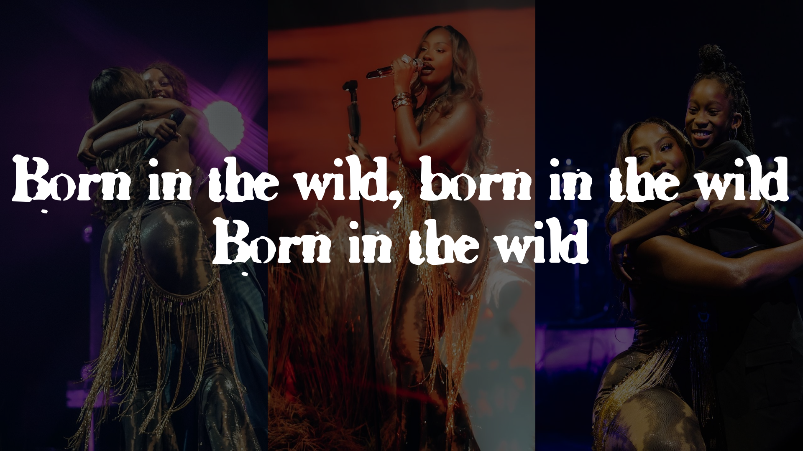

# Lyric Video Generator

This project creates lyric videos using Python, PIL, and MoviePy.

## Features

- Generate lyric videos with customizable fonts and background images
- Synchronize lyrics with audio tracks
- Create visually appealing lyric displays

## Components

### LyricsMaker Class

The main class for generating lyric videos.

#### Methods:

- `__init__(self, lyrics, font_size, font_name, image_name)`: Initializes the LyricsMaker with lyrics, font settings, and background image.
- `convert_time_to_seconds(self, time_str)`: Converts time strings to seconds.
- `convert_time_range(self, time_range)`: Converts time ranges to start and end seconds.
- `get_text_size(self, text)`: Calculates the size of text for positioning.
- `create_lyric_clips(self)`: Creates individual clips for each lyric segment.
- `create_video(self, output_filename, audio_filename)`: Generates the final lyric video with audio.

### Image Processing (image.py)

Handles background image creation and manipulation.

#### Functions:

- `resizeH(H, img)`: Resizes images to a specified height while maintaining aspect ratio.
- Image enhancement and brightness adjustment.

### Main Script (main.py)

Demonstrates how to create videos from a series of images.

#### Functions:

- create_video_from_images(image_folder, output_file, image_durations): Creates a video from a series of images with specified durations.

## Usage

1. Prepare your lyrics in the required dictionary format.
2. Set up your font and background image.
3. Initialize the LyricsMaker with your settings.
4. Call the `create_video` method to generate your lyric video.

Example:

```python
lyrics = {
    "00-15s": ["Born In The Wild (Tems)", "Lyrics By Stephene"],
    # ... more lyrics ...
}
lyrics_maker = LyricsMaker(lyrics, 100, "SIXTY", "image.png")
lyrics_maker.create_video("BornInTheWild_Lyrics.mp4", "Tems-BornintheWild.mp3")
```


## Demo

Here's a sample output from our Lyric Video Generator:


